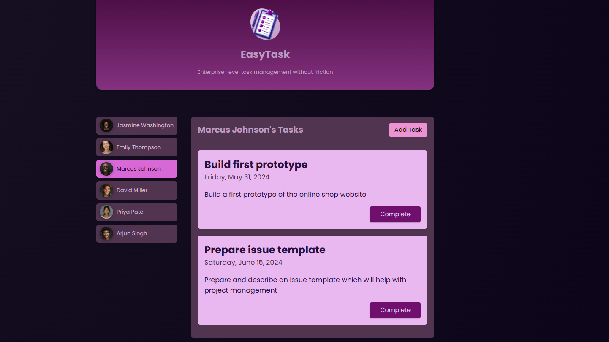
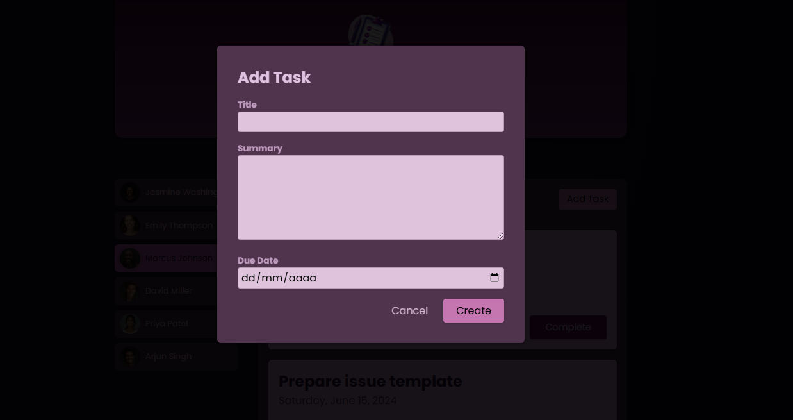

# EasyTask
This project is part of a Udemy course: [The Complete Guide to Angular 2](https://www.udemy.com/course/the-complete-guide-to-angular-2).

This project is a task manager developed in Angular. Each user has an associated task list, and clicking on a user's name displays their tasks. The system allows adding new tasks, marking tasks as completed, and saves the data in localStorage for persistence between page reloads.

Generated using [Angular CLI](https://github.com/angular/angular-cli) version 19.0.6.

## Development server

To start a local development server, run:

```bash
ng serve
```

Once the server is running, open your browser and navigate to `http://localhost:4200/`. The application will automatically reload whenever you modify any of the source files.


## Building

To build the project run:

```bash
ng build
```

This will compile your project and store the build artifacts in the `dist/` directory. By default, the production build optimizes your application for performance and speed.

## Screenshots
Main page:


Add task:



## Features

- User listing.
- Display tasks when clicking on a user’s name.
- Create new tasks.
- Mark tasks as completed.
- Save information in `localStorage`.

