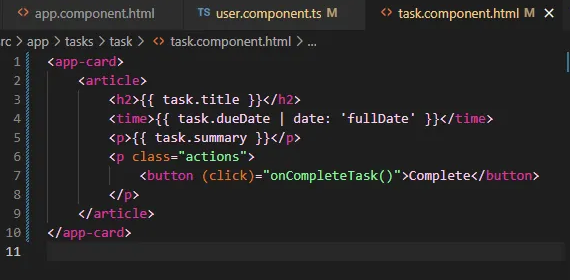
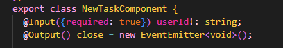

# EasyTask
This project is part of a Udemy course: [The Complete Guide to Angular 2](https://www.udemy.com/course/the-complete-guide-to-angular-2).

This project is a task manager developed in Angular. Each user has an associated task list, and clicking on a user's name displays their tasks. The system allows adding new tasks, marking tasks as completed, and saves the data in localStorage for persistence between page reloads.

Generated using [Angular CLI](https://github.com/angular/angular-cli) version 19.0.6.

## Development server

To start a local development server, run:

```bash
ng serve
```

Once the server is running, open your browser and navigate to `http://localhost:4200/`. The application will automatically reload whenever you modify any of the source files.


## Building

To build the project run:

```bash
ng build
```

This will compile your project and store the build artifacts in the `dist/` directory. By default, the production build optimizes your application for performance and speed.

## Screenshots
Main page:


Add task:


## Features

- User listing.
- Display tasks when clicking on a user’s name.
- Create new tasks.
- Mark tasks as completed.
- Save information in `localStorage`.

## Angular Features Learned

### FORMS - Two way binding

💡 Property + event binding
directives - `ngModel` [(supports two-way binding)]

#### `new-task-component.html`
```html
<div class="backdrop" (click)="onCancel()"></div>
<dialog open>
  <h2>Add Task</h2>
  <form>
    <p>
      <label for="title">Title</label>
      <input type="text" id="title" name="title" [(ngModel)]="enteredTitle" />
    </p>
    <p>
      <label for="summary">Summary</label>
      <textarea id="summary" rows="5" name="summary" [(ngModel)]="enteredSummary"></textarea>
    </p>
    <p>
      <label for="due-date">Due Date</label>
      <input type="date" id="due-date" name="due-date" [(ngModel)]="enteredDate" />
    </p>
    <p class="actions">
      <button type="button" (click)="onCancel()">Cancel</button>
      <button type="submit">Create</button>
    </p>
  </form>
</dialog>
```

#### `new-task-component.ts`
```ts
imports: [ FormsModule],

enteredTitle = '';
enteredSummary = '';
enteredDate = '';

// with signals, first import signal, then:
enteredTitle = signal('');
enteredSummary = signal('');
enteredDate = signal('');
```

### Content Projection

Created a reusable card component with pre-styled div and CSS for use across the project.

```html
<div>
    <ng-content />
</div>
```

```html
<app-card>
    <button [class]="selected" (click)="onSelectUser()" >
        
        <span>{{ user.name }}</span>
    </button>
</app-card>
```

### DatePipe

[Angular DatePipe Documentation](https://angular.dev/api/common/DatePipe)

Example using `fullDate`:
```ts
import { DatePipe } from '@angular/common';
```


### Dependency Injection

You tell Angular which type of value you need, and Angular creates it and provides it as an argument.

Example:
```ts
constructor(private myService: MyService) {}
```

or using `@Injectable()`:
```ts
@Injectable({
  providedIn: 'root'
})
export class MyService {}
```

### LocalStorage

Example of storing and retrieving data:
```ts
constructor(){
    const tasks = localStorage.getItem('tasks');

    if(tasks){
        this.tasks = JSON.parse(tasks);
    }
}

private saveTasks(){
    localStorage.setItem('tasks', JSON.stringify(this.tasks));
}
```

### Input & Output

- **Input** - Data passed from a parent component to a child component.
- **Output** - Events emitted from the child component to the parent.

